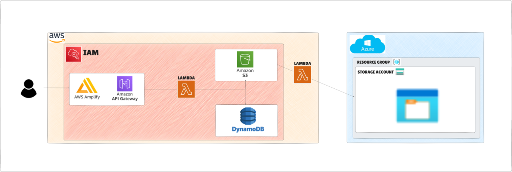

# Image Upload and Classification Pipeline – AWS & Azure Integration

## Overview
This project implements a **serverless, multi-cloud image processing pipeline**.  
Users can upload images through a **web page hosted on AWS Amplify**, which triggers a fully automated workflow to store, analyze, and back up the files using **AWS** and **Azure** services.  

The solution demonstrates:
- Secure IAM configuration with the **principle of least privilege**
- Integration between **AWS Lambda, Amazon Rekognition, S3, DynamoDB** and **Azure Blob Storage**
- Event-driven architecture with API Gateway triggers and S3 event notifications
- Multi-cloud backup strategy

---

## Architecture

**Flow:**
1. **Frontend (AWS Amplify + GitHub)**  
   - HTML page hosted on AWS Amplify, connected to GitHub for automatic deployments.  
   - Includes an upload button for the user to submit an image.

2. **API Gateway**  
   - REST API endpoint receives the uploaded image.  
   - Acts as a trigger for the first AWS Lambda function.

3. **Lambda #1 – Upload & Classification**  
   - Uploads the image to an Amazon S3 bucket.  
   - Sends the image to **Amazon Rekognition** for label detection.  
   - Stores the detected labels in **Amazon DynamoDB**.

4. **Lambda #2 – Azure Backup**  
   - Triggered by an S3 **PUT** event.  
   - Transfers the uploaded image to **Azure Blob Storage** as a backup.

---

## Technologies Used

- **AWS Amplify** – Frontend hosting & CI/CD  
- **Amazon API Gateway** – REST API trigger for Lambda  
- **AWS Lambda** – Serverless functions for processing and migration  
- **Amazon S3** – Main image storage & event trigger  
- **Amazon Rekognition** – Image analysis and labeling  
- **Amazon DynamoDB** – Metadata storage for image labels  
- **Azure Blob Storage** – Backup storage in Azure  
- **IAM (AWS Identity and Access Management)** – Secure, minimal-permission roles  

---

## Security Practices

- Created an **IAM user** with **minimum required privileges** for each AWS service involved.  
- No hardcoded secrets – credentials and sensitive data are stored in **environment variables**.  

---
